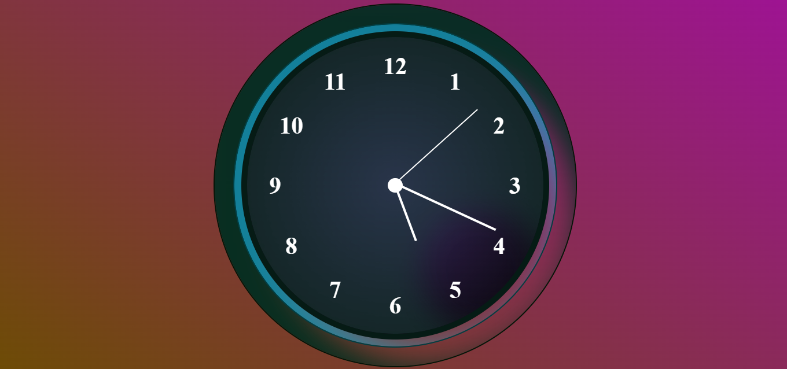

# Analog Clock

An interactive analog clock built using HTML, CSS, and JavaScript. The clock displays the current time with smooth hand movements and a visually appealing design.

## Table of Contents

- [Demo](#demo)
- [Features](#features)
- [Getting Started](#getting-started)
- [Usage](#usage)
- [Customization](#customization)
- [Contributing](#contributing)
- [License](#license)

## Demo

## Features

- Real-time display of current time with hour, minute, and second hands
- Smooth transition between time updates for a visually appealing experience
- Stylish design with customizable colors and layout
- Responsive design that adapts to different screen sizes

Prerequisites
1.Modern web browser (Chrome, Firefox, Safari, etc.)

Files
1.index.html: Contains the HTML structure for the digital clock.
2.style.css: Defines the visual styling and layout of the digital clock.
3.clock.js: Provides the JavaScript logic to update the clock every second.

## Getting Started

To run the clock locally on your machine, follow these steps:

1.Clone the repository:
git clone https://github.com/your-username/analog-clock.git

2.Navigate to the project directory:
cd analog-clock

3.Open the index.html file in a web browser.

Usage
The analog clock will be displayed on the page with the clock hands indicating the current time. The hands move smoothly to show the passage of time.

Customization
You can customize the clock's appearance by modifying the CSS styles in the style.css file. Adjust the colors, sizes, and layouts to match your desired design.

Contributions
Contributions are welcome! If you find a bug or have an improvement in mind, feel free to open an issue or create a pull request.

1.Fork the repository.
2.Create a new branch for your feature/fix: git checkout -b feature-name
3.Make your changes and commit them: git commit -m "Description of changes"
4.Push your changes to the branch: git push origin feature-name
5.Open a pull request.

Credits
This project was created by Maham Shoaib and is inspired by various CSS animations and layout techniques found on the web.

License
This work is licensed under the Creative Commons Attribution 4.0 International License. To view a copy of this license, visit http://creativecommons.org/licenses/by/4.0/ or send a letter to Creative Commons, PO Box 1866, Mountain View, CA 94042, USA.